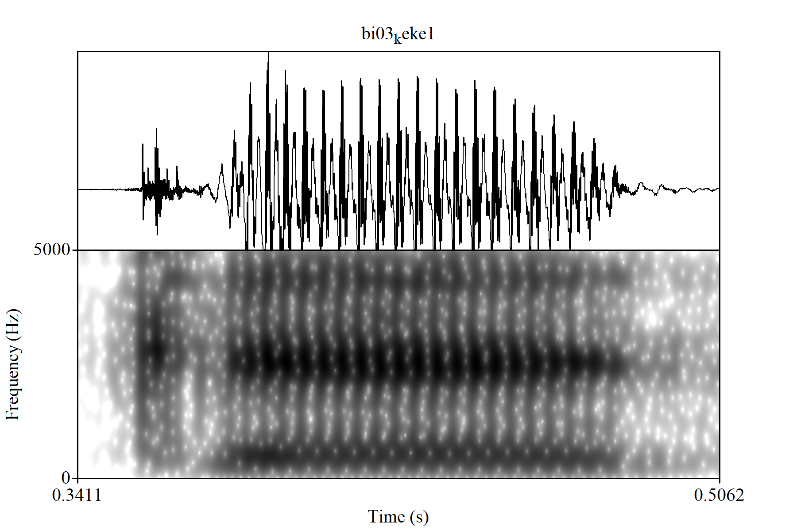

**Author**: Gabriela Constantin-Dureci  
**Date**: Last update: `r Sys.time()`

# Overview

<!-- 
  Talk briefly about what you did here 
  Describe your hypotheses
-->

## What did I do?

For this assignment, I first looked at the R project and read each Rmd file to figure out where it would be best to start. I looked at the scripts and the example recordings (i.e., bi01). The first script was not broken, so there was nothing to be fixed, but I had to keep in mind to run it first (before the other two scripts). The second script had some missing information; I just had to add the participant ID (i.e., bi02) and also replace "XXXX" with "45" (i.e., the total number of recordings per participant). (I hope I did this well!) After running the second script, I got the textgrids for each recording. (I did, however, have to run the second script individually for each participant, so I wonder if there is a way (that I might have missed) to create a loop to run it automatically for various participants). Then, I manually segmented the data for each participant (THIS TOOK A WHILE!). Then, for each participant, I ran the third script to extract the data (I forgot to say that I first fixed the script; I added the corresponding participant ID and removed a superfluous pound sign that had gotten lost in there.) After running the thrid script, the .csv files were created for each participant.

## Hypothesis

Since half of the production data came from L2 Spanish learners (n=3), we can expect that their L1 (English) would affect their production of words that they assumed to be Spanish. Additionally, in terms of VOT, Spanish and English can be characterized differently (i.e., Spanish has short and lead lag, while English has short, long, and lead lag). More commonly, this is expressed under the idea that the VOT for Spanish stops is shorter compared to the longer VOT that English stops have. Therefore, my hypothesis is the following: *The L2 learners will have longer VOTs (due to influence of the L1, English)*

# Prep

## Libraries

```{r}
library("dplyr")   
library("ggplot2") 
library("readr")   
library("here")    
library("tidyr")
library("stringr")
library("knitr")

```

## Load data

```{r}
#| label: load-data
# You need to get all the files in the 'data' directory and combine them
# Check previous examples we did in class 

here("data")

read_csv(file = "../data/bi01.csv")
read_csv(file = "../data/bi02.csv")
read_csv(file = "../data/bi03.csv")
read_csv(file = "../data/ne01.csv")
read_csv(file = "../data/ne02.csv")
read_csv(file = "../data/ne03.csv")

bi01 <- read_csv(here("data", "bi01.csv"))
bi02 <- read_csv(here("data", "bi02.csv"))
bi03 <- read_csv(here("data", "bi03.csv"))
ne01 <- read_csv(here("data", "ne01.csv"))
ne02 <- read_csv(here("data", "ne02.csv"))
ne03 <- read_csv(here("data", "ne03.csv"))

data<-rbind(bi01,bi02,bi03, ne01,ne02, ne03)

bi<-rbind(bi01,bi02,bi03)
ne<-rbind(ne01,ne02, ne03)

```

## Tidy data

```{r}
#| label: tidy-data
# Convert from long to wide or wide to long format as necessary (check 
# examples from class)
# Create any other relevant variables here 

#Get rid of unnecessary columns

#Overall data
data_cleanup<-data%>%
   separate(fileID,into = c("id","stim"), sep = 4)%>%
  mutate(word = str_remove(stim,"[_]"))%>%
  mutate(item = str_remove(word, "[1-2]"))

#Bilingual data
bi_cleanup<-bi%>%
   separate(fileID,into = c("id","stim"), sep = 4)%>%
  mutate(word = str_remove(stim,"[_]"))%>%
  mutate(item = str_remove(word, "[1-2]"))

#Learner data
ne_cleanup<-ne%>%
   separate(fileID,into = c("id","stim"), sep = 4)%>%
  mutate(word = str_remove(stim,"[_]"))%>%
  mutate(item = str_remove(word, "[1-2]"))


#Select only those columns that are important.
#Overall data
data_total<-select(data_cleanup, id, item, vot, f1, f2)
#Bilingual data
bi_total<-select(bi_cleanup, id, item, vot, f1, f2)
#Learner
ne_total<-select(ne_cleanup, id, item, vot, f1, f2)

```

# Analysis

## Descriptives

```{r}
#| label: descriptive-stats
# Give some descriptive summaries of your data 
# Display your descriptives in a table (try knitr::kable())

# Overall stats(VOT, f1, f2)

data_stats<-data_total %>% 
  group_by(id) %>% 
  summarize(vot_mean=mean(vot), f1_mean=mean(f1), f2_mean= mean(f2))

knitr::kable (data_stats, "html")

# Overall stats(VOT)

data_vot<-data_total %>% 
  group_by(id) %>% 
  summarize(vot_mean=mean(vot))

knitr::kable (data_vot, "html")


# Bilingual Group Statistics (VOT per individual participant)

bi_vot<-bi_total %>% 
  group_by(id) %>% 
  summarize(vot_mean=mean(vot))

knitr::kable (bi_vot, "html")

# Bilingual Group Statistics (VOT per whole group)
bi_vot_global<-bi_total %>% 
  summarize(vot_mean=mean(vot))

knitr::kable (bi_vot_global, "html")

# Learner Group Statistics (VOT per individual participant)

ne_vot<-ne_total %>% 
  group_by(id) %>% 
  summarize(vot_mean=mean(vot))

knitr::kable (ne_vot, "html")

# Learner Group Statistics (VOT per whole group)
ne_vot_global<-ne_total %>% 
  summarize(vot_mean=mean(vot))

knitr::kable (ne_vot_global, "html")

```


## Visualization

### Plots
```{r}
#| label: plots 
#| fig.retina: 2
# Include some plots here

data_total %>% 
  ggplot(.,aes(x=vot, y=item, color=id))+
  geom_point()

data_stats %>% 
  ggplot(.,aes(x=vot_mean, y=id))+
  geom_point()

```

### Praat Images
<!-- 
Also include a professional looking figure illustrating an example of the acoustics 
of the production data, i.e., a plot generated in praat.
You decide what is relevant (something related to your hypothesis). 
Think about where this file should be located in your project. 
What location makes most sense in terms of organization? 
How will you access the file (path) from this .Rmd file?
If you need help consider the following sources: 
  - Search 'Rmarkdown image' on google, stackoverflow, etc.
  - Search the 'knitr' package help files in RStudio
  - Search the internet for HTML code (not recommended, but it works)
  - Check the code from my class presentations (may or may not be helpful)
-->




## Hypothesis test

```{r}
#| label: stats
# Conduct a simple statistical analysis here (optional)


```

# Conclusion

<!-- 
Revisit your hypotheses (refer to plots, figures, tables, statistical tests, 
etc.)

Reflect on the entire process. 
What did you enjoy? What did you hate? What did you learn? 
What would you do differently?
-->

The initial hypothesis was: *The L2 learners will have longer VOTs (due to influence of the L1, English)*. After analyzing the data, specifically the VOT averages for bilingual participants compared to the VOT averages for L2 learners, we can see that each individual L2 learner had longer VOT than the bilingual participants.
```{r}
knitr::kable (bi_vot, "html")
```
```{r}
knitr::kable (ne_vot, "html")
```

Additionally, taken as a whole, the L2 learner group also had longer VOT than the bilingual group.

```{r}
knitr::kable (ne_vot_global, "html")
```

```{r}
knitr::kable (bi_vot_global, "html")
```

By comparing these values, the evidence seems to support the initial hypothesis. Lastly, a visual inspection of the two images from Praat (see above) suggest similar results.

## Reflections

This was definitely the longest programming assignment. It helped to be systematic about running the scripts and segmenting data (though it did get tedious). I liked that I was able to include the Praat images/ screenshots (not sure how to call them).


</br></br>
