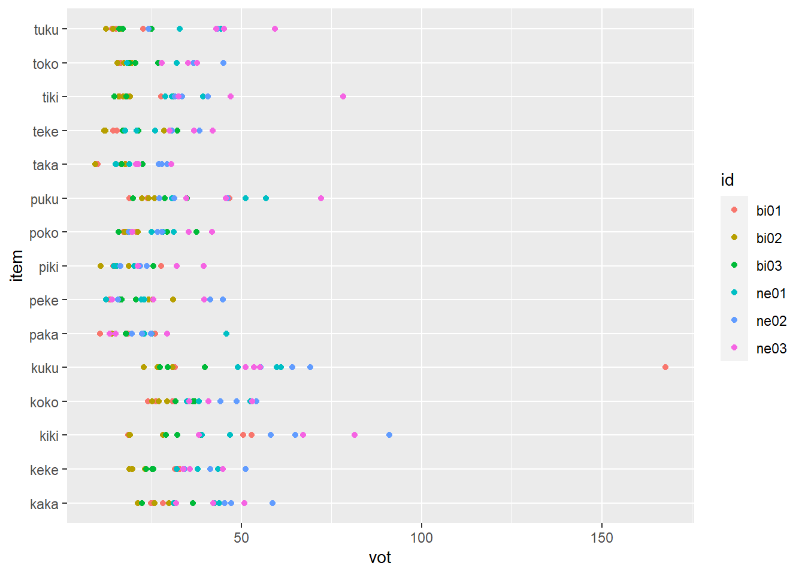
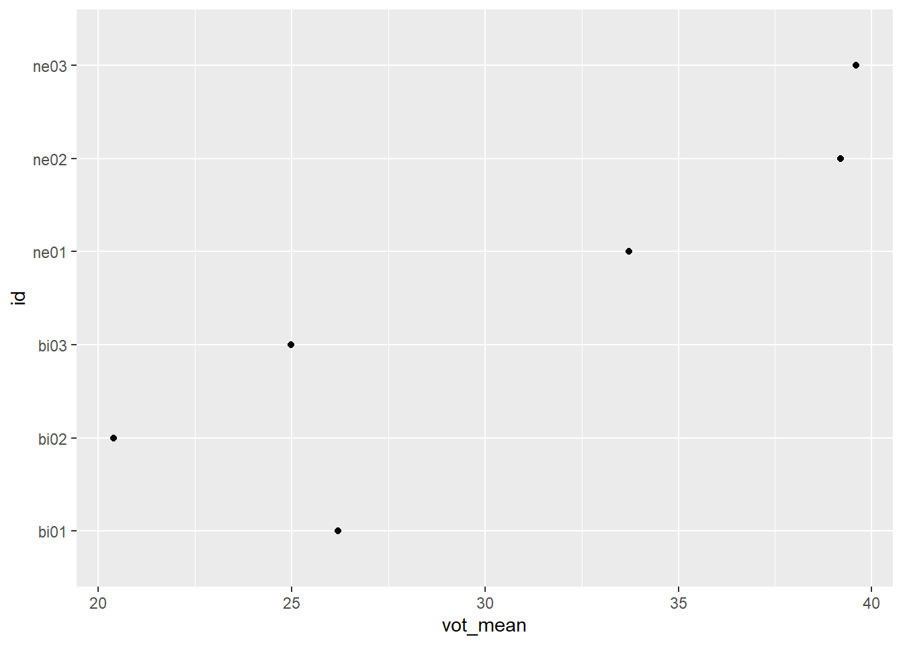

Programming assignment 4
================

**Author**: Gabriela Constantin-Dureci  
**Date**: Last update: 2022-04-17 02:28:01

# Overview

<!-- 
  Talk briefly about what you did here 
  Describe your hypotheses
-->

## What did I do?

For this assignment, I first looked at the R project and read each Rmd
file to figure out where it would be best to start. I looked at the
scripts and the example recordings (i.e., bi01). The first script was
not broken, so there was nothing to be fixed, but I had to keep in mind
to run it first (before the other two scripts). The second script had
some missing information; I just had to add the participant ID (i.e.,
bi02) and also replace “XXXX” with “45” (i.e., the total number of
recordings per participant). (I hope I did this well!) After running the
second script, I got the textgrids for each recording. (I did, however,
have to run the second script individually for each participant, so I
wonder if there is a way (that I might have missed) to create a loop to
run it automatically for various participants). Then, I manually
segmented the data for each participant (THIS TOOK A WHILE!). Then, for
each participant, I ran the third script to extract the data (I forgot
to say that I first fixed the script; I added the corresponding
participant ID and removed a superfluous pound sign that had gotten lost
in there.) After running the thrid script, the .csv files were created
for each participant.

## Hypothesis

Since half of the production data came from L2 Spanish learners (n=3),
we can expect that their L1 (English) would affect their production of
words that they assumed to be Spanish. Additionally, in terms of VOT,
Spanish and English can be characterized differently (i.e., Spanish has
short and lead lag, while English has short, long, and lead lag). More
commonly, this is expressed under the idea that the VOT for Spanish
stops is shorter compared to the longer VOT that English stops have.
Therefore, my hypothesis is the following: *The L2 learners will have
longer VOTs (due to influence of the L1, English)*

# Prep

## Libraries

``` r
library("dplyr")   
```

    ## 
    ## Attaching package: 'dplyr'

    ## The following objects are masked from 'package:stats':
    ## 
    ##     filter, lag

    ## The following objects are masked from 'package:base':
    ## 
    ##     intersect, setdiff, setequal, union

``` r
library("ggplot2") 
library("readr")   
library("here")    
```

    ## here() starts at C:/Users/gcons/Desktop/pa_4

``` r
library("tidyr")
library("stringr")
library("knitr")
```

## Load data

``` r
# You need to get all the files in the 'data' directory and combine them
# Check previous examples we did in class 

here("data")
```

    ## [1] "C:/Users/gcons/Desktop/pa_4/data"

``` r
read_csv(file = "../data/bi01.csv")
```

    ## Rows: 45 Columns: 5
    ## -- Column specification --------------------------------------------------------
    ## Delimiter: ","
    ## chr (2): fileID, notes
    ## dbl (3): f1, f2, vot
    ## 
    ## i Use `spec()` to retrieve the full column specification for this data.
    ## i Specify the column types or set `show_col_types = FALSE` to quiet this message.

    ## # A tibble: 45 x 5
    ##    fileID        f1    f2   vot notes
    ##    <chr>      <dbl> <dbl> <dbl> <chr>
    ##  1 bi01_kaka   651. 1637.  24.8 <NA> 
    ##  2 bi01_kaka1  714. 1568.  25.5 <NA> 
    ##  3 bi01_kaka2  709. 1560.  28.3 <NA> 
    ##  4 bi01_keke   495. 2168.  31.6 <NA> 
    ##  5 bi01_keke1  893. 2153.  32.4 <NA> 
    ##  6 bi01_keke2  579. 2339.  32.9 <NA> 
    ##  7 bi01_kiki   824. 2712.  18.5 <NA> 
    ##  8 bi01_kiki1  348. 2632.  52.8 <NA> 
    ##  9 bi01_kiki2  494. 2766.  50.5 <NA> 
    ## 10 bi01_koko   499. 1050.  30.9 <NA> 
    ## # ... with 35 more rows

``` r
read_csv(file = "../data/bi02.csv")
```

    ## Rows: 45 Columns: 5
    ## -- Column specification --------------------------------------------------------
    ## Delimiter: ","
    ## chr (1): fileID
    ## dbl (3): f1, f2, vot
    ## lgl (1): notes
    ## 
    ## i Use `spec()` to retrieve the full column specification for this data.
    ## i Specify the column types or set `show_col_types = FALSE` to quiet this message.

    ## # A tibble: 45 x 5
    ##    fileID        f1    f2   vot notes
    ##    <chr>      <dbl> <dbl> <dbl> <lgl>
    ##  1 bi02_kaka   784. 1574.  21.2 NA   
    ##  2 bi02_kaka1  768. 1522.  29.8 NA   
    ##  3 bi02_kaka2  534. 1494.  25.8 NA   
    ##  4 bi02_keke   473. 2186.  23.3 NA   
    ##  5 bi02_keke1  467. 2335.  19.7 NA   
    ##  6 bi02_keke2  527. 2234.  18.9 NA   
    ##  7 bi02_kiki   336. 2625.  28.2 NA   
    ##  8 bi02_kiki1  348. 2693.  19.0 NA   
    ##  9 bi02_kiki2  339. 2661   18.9 NA   
    ## 10 bi02_koko   617.  993.  29.3 NA   
    ## # ... with 35 more rows

``` r
read_csv(file = "../data/bi03.csv")
```

    ## Rows: 45 Columns: 5
    ## -- Column specification --------------------------------------------------------
    ## Delimiter: ","
    ## chr (1): fileID
    ## dbl (3): f1, f2, vot
    ## lgl (1): notes
    ## 
    ## i Use `spec()` to retrieve the full column specification for this data.
    ## i Specify the column types or set `show_col_types = FALSE` to quiet this message.

    ## # A tibble: 45 x 5
    ##    fileID        f1    f2   vot notes
    ##    <chr>      <dbl> <dbl> <dbl> <lgl>
    ##  1 bi03_kaka  1188. 1889.  22.4 NA   
    ##  2 bi03_kaka1  830. 1497.  36.5 NA   
    ##  3 bi03_kaka2  826. 1657.  31.7 NA   
    ##  4 bi03_keke   627. 2397.  23.5 NA   
    ##  5 bi03_keke1  527. 2278.  25.6 NA   
    ##  6 bi03_keke2  403. 2525.  25.2 NA   
    ##  7 bi03_kiki   424. 2669.  38.4 NA   
    ##  8 bi03_kiki1  354. 2694.  32.2 NA   
    ##  9 bi03_kiki2  340. 2683.  29.0 NA   
    ## 10 bi03_koko   468.  858.  31.7 NA   
    ## # ... with 35 more rows

``` r
read_csv(file = "../data/ne01.csv")
```

    ## Rows: 45 Columns: 5
    ## -- Column specification --------------------------------------------------------
    ## Delimiter: ","
    ## chr (1): fileID
    ## dbl (3): f1, f2, vot
    ## lgl (1): notes
    ## 
    ## i Use `spec()` to retrieve the full column specification for this data.
    ## i Specify the column types or set `show_col_types = FALSE` to quiet this message.

    ## # A tibble: 45 x 5
    ##    fileID        f1    f2   vot notes
    ##    <chr>      <dbl> <dbl> <dbl> <lgl>
    ##  1 ne01_kaka   896. 1648.  42.6 NA   
    ##  2 ne01_kaka1  952. 1769.  43.9 NA   
    ##  3 ne01_kaka2 1081. 1744.  31.2 NA   
    ##  4 ne01_keke   466. 2463.  43.5 NA   
    ##  5 ne01_keke1  589. 2500.  37.8 NA   
    ##  6 ne01_keke2  493. 2634.  32.1 NA   
    ##  7 ne01_kiki   353. 2845.  39.0 NA   
    ##  8 ne01_kiki1 1166. 2180.  58.1 NA   
    ##  9 ne01_kiki2  439. 2792.  46.8 NA   
    ## 10 ne01_koko   659. 1075.  52.4 NA   
    ## # ... with 35 more rows

``` r
read_csv(file = "../data/ne02.csv")
```

    ## Rows: 45 Columns: 5
    ## -- Column specification --------------------------------------------------------
    ## Delimiter: ","
    ## chr (1): fileID
    ## dbl (3): f1, f2, vot
    ## lgl (1): notes
    ## 
    ## i Use `spec()` to retrieve the full column specification for this data.
    ## i Specify the column types or set `show_col_types = FALSE` to quiet this message.

    ## # A tibble: 45 x 5
    ##    fileID        f1    f2   vot notes
    ##    <chr>      <dbl> <dbl> <dbl> <lgl>
    ##  1 ne02_kaka   850. 1602.  45.4 NA   
    ##  2 ne02_kaka1  739. 2153.  58.6 NA   
    ##  3 ne02_kaka2 1159. 1629.  47.1 NA   
    ##  4 ne02_keke   480. 2412.  41.4 NA   
    ##  5 ne02_keke1  461. 2459.  51.2 NA   
    ##  6 ne02_keke2  498. 2252.  34.2 NA   
    ##  7 ne02_kiki   357. 2687.  64.9 NA   
    ##  8 ne02_kiki1  344. 2782.  91.0 NA   
    ##  9 ne02_kiki2  333. 2751.  58.0 NA   
    ## 10 ne02_koko   564. 1047.  54.1 NA   
    ## # ... with 35 more rows

``` r
read_csv(file = "../data/ne03.csv")
```

    ## Rows: 45 Columns: 5
    ## -- Column specification --------------------------------------------------------
    ## Delimiter: ","
    ## chr (1): fileID
    ## dbl (3): f1, f2, vot
    ## lgl (1): notes
    ## 
    ## i Use `spec()` to retrieve the full column specification for this data.
    ## i Specify the column types or set `show_col_types = FALSE` to quiet this message.

    ## # A tibble: 45 x 5
    ##    fileID        f1    f2   vot notes
    ##    <chr>      <dbl> <dbl> <dbl> <lgl>
    ##  1 ne03_kaka   794. 1786.  31.9 NA   
    ##  2 ne03_kaka1  837. 1682.  42.1 NA   
    ##  3 ne03_kaka2  879. 1549.  50.8 NA   
    ##  4 ne03_keke   546. 2642.  35.7 NA   
    ##  5 ne03_keke1  569. 1787.  33.9 NA   
    ##  6 ne03_keke2  568. 2484.  44.9 NA   
    ##  7 ne03_kiki   531. 2731.  38.1 NA   
    ##  8 ne03_kiki1  412. 2012.  81.4 NA   
    ##  9 ne03_kiki2  373. 2806.  67.2 NA   
    ## 10 ne03_koko   511. 1071.  53.0 NA   
    ## # ... with 35 more rows

``` r
bi01 <- read_csv(here("data", "bi01.csv"))
```

    ## Rows: 45 Columns: 5
    ## -- Column specification --------------------------------------------------------
    ## Delimiter: ","
    ## chr (2): fileID, notes
    ## dbl (3): f1, f2, vot
    ## 
    ## i Use `spec()` to retrieve the full column specification for this data.
    ## i Specify the column types or set `show_col_types = FALSE` to quiet this message.

``` r
bi02 <- read_csv(here("data", "bi02.csv"))
```

    ## Rows: 45 Columns: 5
    ## -- Column specification --------------------------------------------------------
    ## Delimiter: ","
    ## chr (1): fileID
    ## dbl (3): f1, f2, vot
    ## lgl (1): notes
    ## 
    ## i Use `spec()` to retrieve the full column specification for this data.
    ## i Specify the column types or set `show_col_types = FALSE` to quiet this message.

``` r
bi03 <- read_csv(here("data", "bi03.csv"))
```

    ## Rows: 45 Columns: 5
    ## -- Column specification --------------------------------------------------------
    ## Delimiter: ","
    ## chr (1): fileID
    ## dbl (3): f1, f2, vot
    ## lgl (1): notes
    ## 
    ## i Use `spec()` to retrieve the full column specification for this data.
    ## i Specify the column types or set `show_col_types = FALSE` to quiet this message.

``` r
ne01 <- read_csv(here("data", "ne01.csv"))
```

    ## Rows: 45 Columns: 5
    ## -- Column specification --------------------------------------------------------
    ## Delimiter: ","
    ## chr (1): fileID
    ## dbl (3): f1, f2, vot
    ## lgl (1): notes
    ## 
    ## i Use `spec()` to retrieve the full column specification for this data.
    ## i Specify the column types or set `show_col_types = FALSE` to quiet this message.

``` r
ne02 <- read_csv(here("data", "ne02.csv"))
```

    ## Rows: 45 Columns: 5
    ## -- Column specification --------------------------------------------------------
    ## Delimiter: ","
    ## chr (1): fileID
    ## dbl (3): f1, f2, vot
    ## lgl (1): notes
    ## 
    ## i Use `spec()` to retrieve the full column specification for this data.
    ## i Specify the column types or set `show_col_types = FALSE` to quiet this message.

``` r
ne03 <- read_csv(here("data", "ne03.csv"))
```

    ## Rows: 45 Columns: 5
    ## -- Column specification --------------------------------------------------------
    ## Delimiter: ","
    ## chr (1): fileID
    ## dbl (3): f1, f2, vot
    ## lgl (1): notes
    ## 
    ## i Use `spec()` to retrieve the full column specification for this data.
    ## i Specify the column types or set `show_col_types = FALSE` to quiet this message.

``` r
data<-rbind(bi01,bi02,bi03, ne01,ne02, ne03)

bi<-rbind(bi01,bi02,bi03)
ne<-rbind(ne01,ne02, ne03)
```

## Tidy data

``` r
# Convert from long to wide or wide to long format as necessary (check 
# examples from class)
# Create any other relevant variables here 

#Get rid of unnecessary columns

#Overall data
data_cleanup<-data%>%
   separate(fileID,into = c("id","stim"), sep = 4)%>%
  mutate(word = str_remove(stim,"[_]"))%>%
  mutate(item = str_remove(word, "[1-2]"))

#Bilingual data
bi_cleanup<-bi%>%
   separate(fileID,into = c("id","stim"), sep = 4)%>%
  mutate(word = str_remove(stim,"[_]"))%>%
  mutate(item = str_remove(word, "[1-2]"))

#Learner data
ne_cleanup<-ne%>%
   separate(fileID,into = c("id","stim"), sep = 4)%>%
  mutate(word = str_remove(stim,"[_]"))%>%
  mutate(item = str_remove(word, "[1-2]"))


#Select only those columns that are important.
#Overall data
data_total<-select(data_cleanup, id, item, vot, f1, f2)
#Bilingual data
bi_total<-select(bi_cleanup, id, item, vot, f1, f2)
#Learner
ne_total<-select(ne_cleanup, id, item, vot, f1, f2)
```

# Analysis

## Descriptives

``` r
# Give some descriptive summaries of your data 
# Display your descriptives in a table (try knitr::kable())

# Overall stats(VOT, f1, f2)

data_stats<-data_total %>% 
  group_by(id) %>% 
  summarize(vot_mean=mean(vot), f1_mean=mean(f1), f2_mean= mean(f2))

knitr::kable (data_stats, "html")
```

<table>
<thead>
<tr>
<th style="text-align:left;">
id
</th>
<th style="text-align:right;">
vot_mean
</th>
<th style="text-align:right;">
f1_mean
</th>
<th style="text-align:right;">
f2_mean
</th>
</tr>
</thead>
<tbody>
<tr>
<td style="text-align:left;">
bi01
</td>
<td style="text-align:right;">
26.19733
</td>
<td style="text-align:right;">
520.2511
</td>
<td style="text-align:right;">
1727.237
</td>
</tr>
<tr>
<td style="text-align:left;">
bi02
</td>
<td style="text-align:right;">
20.39133
</td>
<td style="text-align:right;">
524.7984
</td>
<td style="text-align:right;">
1587.086
</td>
</tr>
<tr>
<td style="text-align:left;">
bi03
</td>
<td style="text-align:right;">
24.98889
</td>
<td style="text-align:right;">
606.1667
</td>
<td style="text-align:right;">
1732.557
</td>
</tr>
<tr>
<td style="text-align:left;">
ne01
</td>
<td style="text-align:right;">
33.71911
</td>
<td style="text-align:right;">
632.8196
</td>
<td style="text-align:right;">
1872.508
</td>
</tr>
<tr>
<td style="text-align:left;">
ne02
</td>
<td style="text-align:right;">
39.19311
</td>
<td style="text-align:right;">
578.7964
</td>
<td style="text-align:right;">
1857.839
</td>
</tr>
<tr>
<td style="text-align:left;">
ne03
</td>
<td style="text-align:right;">
39.58933
</td>
<td style="text-align:right;">
559.1676
</td>
<td style="text-align:right;">
1617.775
</td>
</tr>
</tbody>
</table>

``` r
# Overall stats(VOT)

data_vot<-data_total %>% 
  group_by(id) %>% 
  summarize(vot_mean=mean(vot))

knitr::kable (data_vot, "html")
```

<table>
<thead>
<tr>
<th style="text-align:left;">
id
</th>
<th style="text-align:right;">
vot_mean
</th>
</tr>
</thead>
<tbody>
<tr>
<td style="text-align:left;">
bi01
</td>
<td style="text-align:right;">
26.19733
</td>
</tr>
<tr>
<td style="text-align:left;">
bi02
</td>
<td style="text-align:right;">
20.39133
</td>
</tr>
<tr>
<td style="text-align:left;">
bi03
</td>
<td style="text-align:right;">
24.98889
</td>
</tr>
<tr>
<td style="text-align:left;">
ne01
</td>
<td style="text-align:right;">
33.71911
</td>
</tr>
<tr>
<td style="text-align:left;">
ne02
</td>
<td style="text-align:right;">
39.19311
</td>
</tr>
<tr>
<td style="text-align:left;">
ne03
</td>
<td style="text-align:right;">
39.58933
</td>
</tr>
</tbody>
</table>

``` r
# Bilingual Group Statistics (VOT per individual participant)

bi_vot<-bi_total %>% 
  group_by(id) %>% 
  summarize(vot_mean=mean(vot))

knitr::kable (bi_vot, "html")
```

<table>
<thead>
<tr>
<th style="text-align:left;">
id
</th>
<th style="text-align:right;">
vot_mean
</th>
</tr>
</thead>
<tbody>
<tr>
<td style="text-align:left;">
bi01
</td>
<td style="text-align:right;">
26.19733
</td>
</tr>
<tr>
<td style="text-align:left;">
bi02
</td>
<td style="text-align:right;">
20.39133
</td>
</tr>
<tr>
<td style="text-align:left;">
bi03
</td>
<td style="text-align:right;">
24.98889
</td>
</tr>
</tbody>
</table>

``` r
# Bilingual Group Statistics (VOT per whole group)
bi_vot_global<-bi_total %>% 
  summarize(vot_mean=mean(vot))

knitr::kable (bi_vot_global, "html")
```

<table>
<thead>
<tr>
<th style="text-align:right;">
vot_mean
</th>
</tr>
</thead>
<tbody>
<tr>
<td style="text-align:right;">
23.85919
</td>
</tr>
</tbody>
</table>

``` r
# Learner Group Statistics (VOT per individual participant)

ne_vot<-ne_total %>% 
  group_by(id) %>% 
  summarize(vot_mean=mean(vot))

knitr::kable (ne_vot, "html")
```

<table>
<thead>
<tr>
<th style="text-align:left;">
id
</th>
<th style="text-align:right;">
vot_mean
</th>
</tr>
</thead>
<tbody>
<tr>
<td style="text-align:left;">
ne01
</td>
<td style="text-align:right;">
33.71911
</td>
</tr>
<tr>
<td style="text-align:left;">
ne02
</td>
<td style="text-align:right;">
39.19311
</td>
</tr>
<tr>
<td style="text-align:left;">
ne03
</td>
<td style="text-align:right;">
39.58933
</td>
</tr>
</tbody>
</table>

``` r
# Learner Group Statistics (VOT per whole group)
ne_vot_global<-ne_total %>% 
  summarize(vot_mean=mean(vot))

knitr::kable (ne_vot_global, "html")
```

<table>
<thead>
<tr>
<th style="text-align:right;">
vot_mean
</th>
</tr>
</thead>
<tbody>
<tr>
<td style="text-align:right;">
37.50052
</td>
</tr>
</tbody>
</table>

## Visualization

### Plots

``` r
# Include some plots here

data_total %>% 
  ggplot(.,aes(x=vot, y=item, color=id))+
  geom_point()
```



``` r
data_stats %>% 
  ggplot(.,aes(x=vot_mean, y=id))+
  geom_point()
```



### Praat Images

<!-- 
Also include a professional looking figure illustrating an example of the acoustics 
of the production data, i.e., a plot generated in praat.
You decide what is relevant (something related to your hypothesis). 
Think about where this file should be located in your project. 
What location makes most sense in terms of organization? 
How will you access the file (path) from this .Rmd file?
If you need help consider the following sources: 
  - Search 'Rmarkdown image' on google, stackoverflow, etc.
  - Search the 'knitr' package help files in RStudio
  - Search the internet for HTML code (not recommended, but it works)
  - Check the code from my class presentations (may or may not be helpful)
-->


## Hypothesis test

``` r
# Conduct a simple statistical analysis here (optional)
```

# Conclusion

<!-- 
Revisit your hypotheses (refer to plots, figures, tables, statistical tests, 
etc.)

Reflect on the entire process. 
What did you enjoy? What did you hate? What did you learn? 
What would you do differently?
-->

The initial hypothesis was: *The L2 learners will have longer VOTs (due
to influence of the L1, English)*. After analyzing the data,
specifically the VOT averages for bilingual participants compared to the
VOT averages for L2 learners, we can see that each individual L2 learner
had longer VOT than the bilingual participants.

``` r
knitr::kable (bi_vot, "html")
```

<table>
<thead>
<tr>
<th style="text-align:left;">
id
</th>
<th style="text-align:right;">
vot_mean
</th>
</tr>
</thead>
<tbody>
<tr>
<td style="text-align:left;">
bi01
</td>
<td style="text-align:right;">
26.19733
</td>
</tr>
<tr>
<td style="text-align:left;">
bi02
</td>
<td style="text-align:right;">
20.39133
</td>
</tr>
<tr>
<td style="text-align:left;">
bi03
</td>
<td style="text-align:right;">
24.98889
</td>
</tr>
</tbody>
</table>

``` r
knitr::kable (ne_vot, "html")
```

<table>
<thead>
<tr>
<th style="text-align:left;">
id
</th>
<th style="text-align:right;">
vot_mean
</th>
</tr>
</thead>
<tbody>
<tr>
<td style="text-align:left;">
ne01
</td>
<td style="text-align:right;">
33.71911
</td>
</tr>
<tr>
<td style="text-align:left;">
ne02
</td>
<td style="text-align:right;">
39.19311
</td>
</tr>
<tr>
<td style="text-align:left;">
ne03
</td>
<td style="text-align:right;">
39.58933
</td>
</tr>
</tbody>
</table>

Additionally, taken as a whole, the L2 learner group also had longer VOT
than the bilingual group.

``` r
knitr::kable (ne_vot_global, "html")
```

<table>
<thead>
<tr>
<th style="text-align:right;">
vot_mean
</th>
</tr>
</thead>
<tbody>
<tr>
<td style="text-align:right;">
37.50052
</td>
</tr>
</tbody>
</table>

``` r
knitr::kable (bi_vot_global, "html")
```

<table>
<thead>
<tr>
<th style="text-align:right;">
vot_mean
</th>
</tr>
</thead>
<tbody>
<tr>
<td style="text-align:right;">
23.85919
</td>
</tr>
</tbody>
</table>

By comparing these values, the evidence seems to support the initial
hypothesis. Lastly, a visual inspection of the two images from Praat
(see above) suggest similar results.

## Reflections

This was definitely the longest programming assignment. It helped to be
systematic about running the scripts and segmenting data (though it did
get tedious). I liked that I was able to include the Praat images/
screenshots (not sure how to call them).

</br></br>
